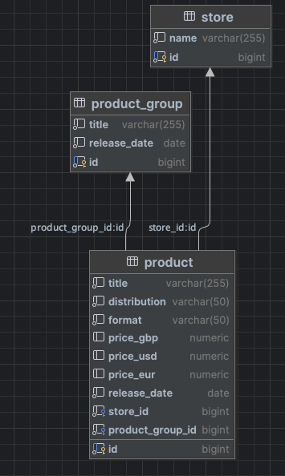

# music-product-api
Spring Boot CRUD API for managing music products

## Running Locally
To run this service locally you'll need docker compose. Run `docker-compose up`. This will make the
service available on port `8080`.

## Database Schema

The database contains three tables:

- Product: Music product details.
- Store: A Store which can contain Products.
- Product_Group: Grouping attributes for a Product.

I went for the simplest approach to representing the data, such that a Store can have many Products, and a Product can have one Product Group.
The schema could be extended further if necessary to allow for Products to be available across multiple Stores, etc. but I just kept it very simple for this exercise.
I chose to use the format `price_gbp` to represent the currencies for simplicity, but you could consider storing the product prices in a separate table with a timestamp column, this would allow you to report on historical price changes if that was a requirement.

## API Design

1. Resources:
    - `/products`: CRUD operations for products.
    - `/stores`: CRUD operations for stores - **NOT IMPLEMENTED**.
    - `/product-groups`: CRUD operations for product groups - **NOT IMPLEMENTED**.

I added placeholder implementations for `stores` and `product-groups`, a real world application would have these, but for the purposes of this exercise I figured the `products` endpoints is enough code :)

2. Filters:
    - `/products/filter`: Products can be listed with filters such as storeName, productGroupTitle, productTitle, release date intervals, etc.
3. Postman Collection:
    - A Postman Collection for each of the implemented endpoints can be found in the `/postman` directory

## Implementation
- I used Postgres for the database, and Flyway for database migrations to create the database tables and seed it with data.
- You can run locally to test using Docker, as discussed previously.
- I created an `ExceptionAdvice` class for the API exception handling, this allowed the Service methods to be less cluttered with conditional checking.
- I chose a Component Testing approach, as opposed to using mocking, as this allows for a more robust set of tests which test against a real database and real network calls. I used Testcontainers Postgres for the test database.

## Further Enhancements
- If the case format of the JSON output from the API needs to be changed, use `@JsonProperty` to format the fields.
- I implemented some basic cases in the ExceptionAdvice handler, a real world application would have more complete handling.
- Add more Validation checking for path variables and payloads within the API.
- Improve test coverage - I did enough for the purposes of this exercise, but there are further test cases that can be added.
- Add pagination to the API list endpoints.
- Consider caching frequently accessed data to improve performance.
- There's no security considerations in this exercise, you'd probably want that in the real world.
- API Documentation - add something like SpringDoc / OpenAPI / Swagger annotations to document the API.
- `GET /products` can be removed, Get All is the same as filter with no query params